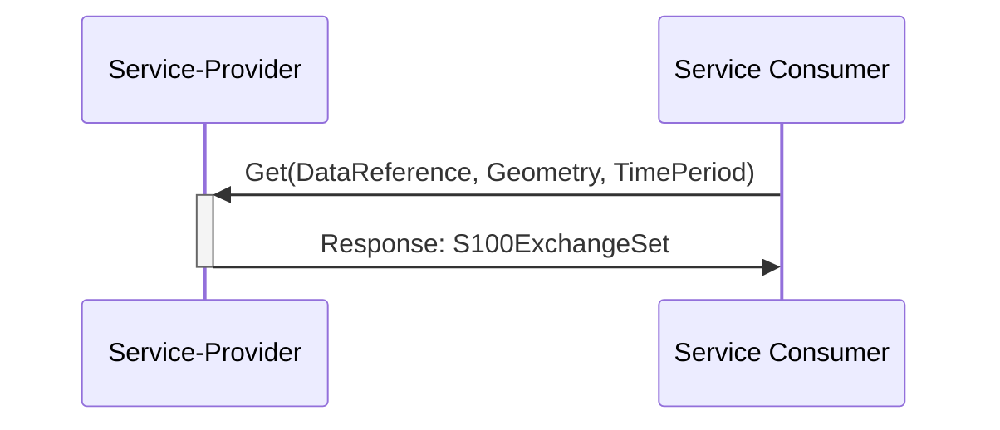
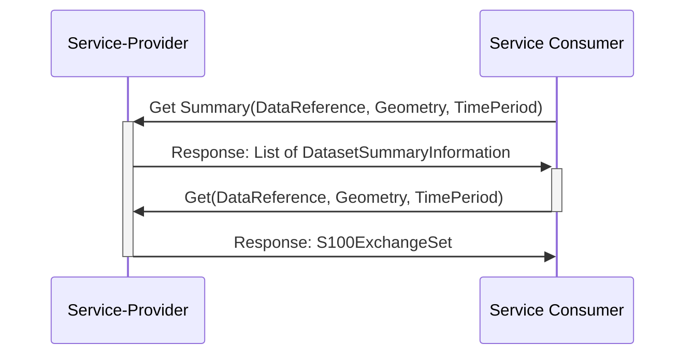
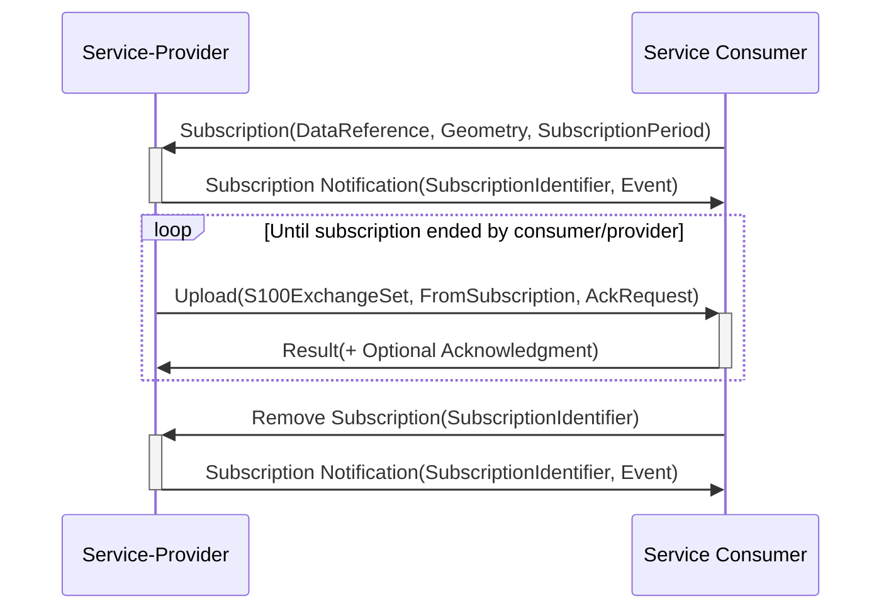

\pagebreak

# Service Dynamic Behaviour {#sec:dynamic_behaviour}

This section describes the interactive behaviour of the operations between the service provider and the service consumers. The AtoN Information service supports two different types of operations, namely the client-initiated retrieval of AtoN information, and the subscription-based AtoN information propagation. Both are discussed in the following sections respectively.

**Note**: The description of the behaviour of the aforementioned operations, is provided in an abstract manner, where generic actions are performed on technology-agnostic endpoints. The implementation of each of these operations is left to be decided by any extending service design documents. In addition, any specific authentication procedure that is being applied is out of scope of the service specification and is described in the service designs of this service. 

# Client-initiated Retrieval of AtoN Information {#sec:dynamic_behaviour_client_init_retrieval}

The client-initiated retrieval is triggered by the service consumer, when it issues request on the appropriate service provider operations (i.e. Get and Get Summary). This operation covers Use ***Case #1***, ***Use Case #2*** and ***Use Case #4***, as outlined in Section [@sec:use-cases]. All three use cases can be achieved by two methods; either by directly requesting specific S-125 datasets, using the operation parameters of the Get operation, or by first requesting the S-125 dataset summary information through the Get Summary operation, and then using the provided dataset reference identifiers, to retrieve the corresponding S-125 datasets. 

The first method is presented in [@fig:dynamic_behaviour_get_operation], where the service consumer contacts directly the Get operation of the service provider. By utilising the available operation parameters such as the geometry, area name, time-period and AtoN identifier, only specific S-125 datasets matching the specified criteria and/or have updates on the specified time-period interval, will be retrieved, packaged into an S-100 Exchange Set, and returned as a response. 

In cases where the service consumer requires more information, before making a decision on which datasets should be downloaded, the latter “Client-initiated AtoN Information Retrieval” method can be utilised, by contacting the Get Summary operation beforehand. This is demonstrated in [@fig:dynamic_behaviour_get_operation], where the service consumer requests the list of the available S-125 dataset metadata via the summary operation and directly receives a response from the service provider. The service consumer can then select a dataset reference identifier from the returned list and request the detailed information (i.e. the complete S-125 dataset) back, through the Get operation of the service provider. The corresponding S-125 dataset (and/or its corresponding updates) will be packaged as an S-100 Exchange Set and then get sent back to the service consumer as direct response.

As demonstrated in [@fig:dynamic_behaviour_get_operation], the Get Summary operation accepts similar operation parameters as the Get operation, which can be employed to filter the summary response list. This feature improves the flexibility of the whole operation as for example, even if a provided geometry operation parameter matches more than one S-125 datasets, only the required dataset will eventually be retrieved by the service consumer, by using its respective dataset reference identifier.

# Subscription-based AtoN Information Propagation {#sec:dynamic_behaviour_subscription_retrieval}

The subscription on AtoN Information is an alternative method of data propagation, in which a service consumer actively registers its interest to receive updates either on a specific set or alternatively, on all available S-125 datasets. This operation covers Use ***Case #3***, as outlined in Section [@sec:use-cases].

[@fig:dynamic_behaviour_get_summary_operation] illustrates the typical behaviour the subscription operation. Initially, the service consumer is required to initiate the subscription through the Subscription operation of the service provider. By utilising the available operation parameters such as the geometry, the area name and the subscription period, only the specific S-125 datasets matching the specified criteria and have updates during the specified subscription interval will be covered. Once the subscription request has been received, processed and accepted by the service provider, a notification should be sent back to the service consumer, using its Subscription Notification operation. This notification will indicate that the requested subscription has commenced and should include the identifier reference of the established subscription.

Whenever an update is made available on the set of S-125 datasets covered by a subscription, the service consumer Upload operation is used to deliver these updates, packaged as S-100 Exchange Sets, to the service consumer. Depending on the implementation of the service, the consumer may be required to respond to this operation by sending an acknowledgement message back to the service provider. This is an optional operation, depending on the implementing technology. Therefore, it is not covered as an operation in this service specification.

The subscription updates will continue to be provided until **one** of the following conditions are met:

  1. The subscription period initially set by the service consumer has expired.
  2. The service consumer requests an end to the active subscription, using the Remove Subscription operation of the service provider.
  3. The service provider removes the information objects covered by the subscription.
  4. An expected incident/unexpected error forces the service provider to terminate the subscription.

In the sequence diagram presented in [@fig:dynamic_behaviour_subscription_operation], the established subscription is terminated though a service consumer request. This should include the identifier reference of the subscription to be terminated, otherwise the service provider will terminate all active subscriptions for the service consumer performing the request. Once the service consumer’s request has been received, processed, and accepted by the service provider, another notification will be sent back to the service consumer’s Subscription Notification operation, to terminate the subscription process.

Note that the full contents of the S-125 datasets covered by a subscription, are not send back to the service consumer, unless a new dataset is created within the active period of an existing subscription that covers it. In all other cases, only the S-125 dataset changes will be transferred, in order to conserve bandwidth. Therefore, service consumer needs to utilise the Get (and Get Summary) operations, if the full contents of the S-125 datasets are required.