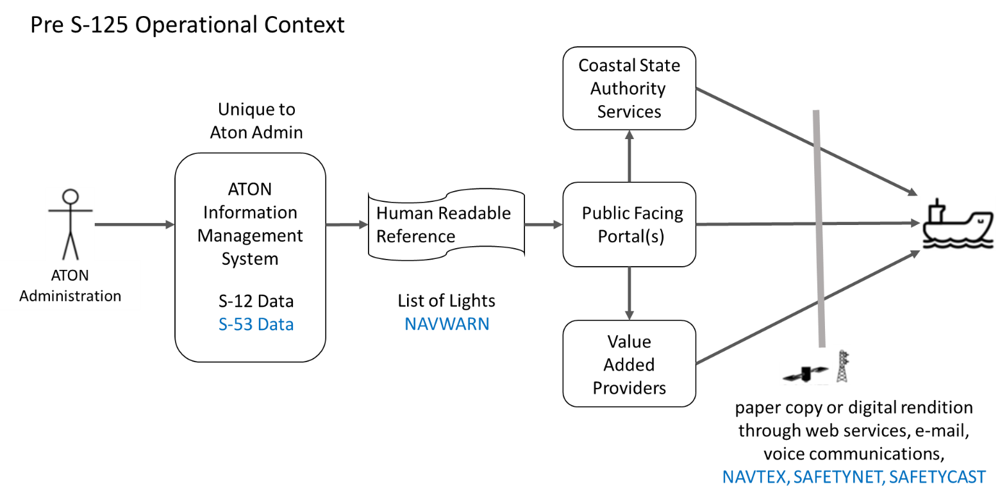
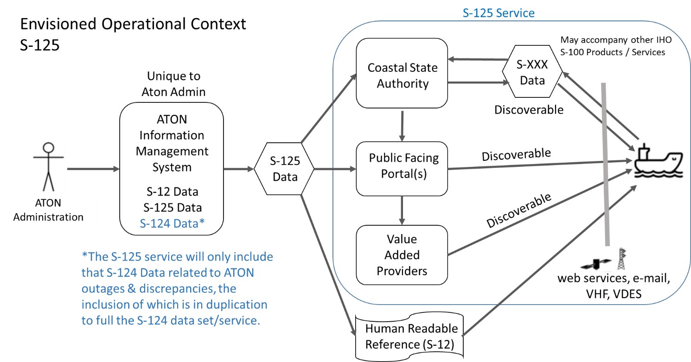
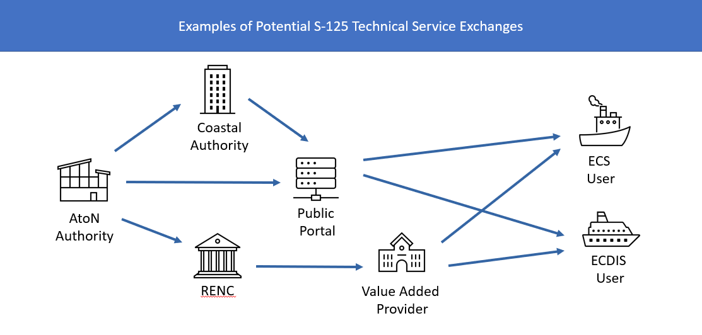

\pagebreak

# Operational Context {#sec:operational_context}

This section describes the context of the service from an operational perspective.

## Pre S-125 Operational Context {sec:pres_125_operational_context}

From a practical perspective, the List of Lights is intended for use by mariners as a compendium to the navigational chart for AtoN information. In accordance with IHO S-12, The List of Lights and Fog Signals describe maritime signal installations on land or afloat producing light or sound signals (fog signals). In addition, these volumes contain information relating to certain other navigational aids: buoyage (day and night); signals (port signals, rescue signals, tide signals, etc.), radio-based aids (radio beacons, radar, radio navigation systems), etc.  

IHO S-53, is concerned with drafting navigational warnings or with the issuance of meteorological forecasts and warnings under the Global Maritime Distress and Safety System (GMDSS). Maritime Safety Information (MSI) is promulgated in accordance with the requirements of IMO resolution A.705(17), as amended. Navigational Warnings are issued under the auspices of the IMO/International Hydrographic Organization (IHO) World-Wide Navigational Warning Service (WWNWS) in accordance with the requirements of IMO resolution A.706(17), as amended. Navigational Warnings (NW), including ATON casualties or changes which may impact navigational safety, are part of the Maritime Safety Information (MSI) system. This includes casualties to lights, fog signals, buoys and other aids to navigation affecting main shipping lanes as well as establishment of major new aids to navigation or significant changes to existing ones, when such establishment or change might be misleading to shipping.  Currently, NW are promulgated as a radio broadcast and then printed in text format. The messages are standardized as SafetyNET, SafetyCast, NAVTEX broadcasts, and are in some countries accessible on the WWW or as voice broadcasts via coastal radio stations.  System interfaces between NW publishers, NAVAREA (or Sub-Area) coordinator and broadcast service are not standardized, and may rely on manual processes involving e-mail, telephone, voice radio transmissions, fax, telex and manual re-entering of information from one system to another, or much more advanced solutions. Provision of NW via web is not standardized. NAVTEX, SafetyCast and SafetyNET cannot transport structured data formats for a joint NW-NM solution.   

The pre-S-125 “present day” operational context of promulgation at the component level, is depicted below. A generalize assumption is made that information management systems are unique to each ATON Administration.

{#fig:present_day_operational_context}

System interfaces between AtoN Administrations, Hydrographic Officers, Nautical Publication Publishers, and dissemination methods are unique, and may rely on manual processes involving carriage of paper print copies or human readable digital renditions obtained via web services or email.  Provision of the AtoN information included within the List of Lights via web services is not standardized. 

## Envisioned Operational Context {#sec:envisioned_operational_context}

{#fig:s125_operational_context}

This scenario depicts an envisaged future of S-125 data exchange. Based on a standardized structured AtoN information (List of Lights) format, compatible systems will be able to exchange AtoN Data seamlessly. As depicted, each AtoN Administration may have a unique AtoN Information Management System. This system should automatically promulgate S-125 Data from the authoritative source for use by national and local authorities (e.g.  Coastal State Authorities, Harbor and Port Authorities), the mariner public, as well as being available for use by commercial value-added services providers.  The provision of an “S-125 Service” described in this document, is depicted as those activities after production of the S-125 data by AtoN administrations in the above diagram. It is envisioned that the legacy IHO S-12 data is a subcomponent and replaced by S-125. Administrations may desire to continue providing S-12 format human readable “paper reference” List of Lights in addition to the S-125 Marine Navigation Services, either transitionally, or indefinitely.

AtoN Administrations will administer and publish local S-125 Data for their area of responsibility, typically this includes areas within that state’s exclusive economic zone. Where appropriate they should coordinate with adjacent or overlapping AtoN administrations who share responsibility within the same waterway.  (e.g. Both the U.S. Coast Guard and Canadian Coast Guard maintain aids to navigation within the waterways comprising the Great Lakes.) The instance descriptions will provide detailed information of coverage area available to users.

{#fig:potential_s125_service_exchanges}

The service described in this specification defines the exchange of AtoN information between a service provider and the end user of such a service. In the most common case, the end user will use an ECDIS to receive and display the information onboard a ship. However, as depicted in [@fig:potential_s125_service_exchanges], the application of this service specification is not limited to the exchange of information from shore to ship. It may also be used to harmonise the exchange of AtoN information between other stakeholders in the data distribution chain before it is received by the end user on a ship. This includes the data exchange between AtoN Authorities, coastal authorities, Regional Electronic Navigational Chart Coordination Centre (RENCs), Value Added Providers, public portals, and other entities. Depending on the specific requirements, the service usage patterns may differ. For example, A Value-Added Provider could pull all available data and subscribe to updates from a data producer (e.g., national AtoN authority) and redistribute the data to the end user via its own implementation of this service (after applying validation checks or optimising the data for a specific group of end users). The orchestration of multiple AtoN information services in the distribution chain, however, is not in the scope of this document and lies within the responsibility of the service provider(s).

### Relationship of S-124 to S-125 {#sec:relationship_of_s124_to_s125}

MSI Providers (National and NAVAREA Co-ordinators) are the recognised authorities for promulgating and cancelling Navigational Warnings.  An AtoN outage, or discrepancy as further defined within the IHO S-53 standard, is reported as a Navigational Warning and immediately communicated by the S-124 service.  Upon confirmation of the discrepancy, the responsible ATON authority will include the report of outage in the S-125 dataset.  The inclusion of the reported outage as part of S-125 will be in duplication to warnings provided as part of S-124. MSI providers are responsible for the removal of any Navigational Warnings from applicable S-124, and the AtoN authority is responsible for withdrawing the outage report from S-125.  A Navigational Warning in S-124 will remain in force and continue to be promulgated by GMDSS broadcast services, since adding the information to the S-125 database will not, on its own, be sufficient to cancel the warning from GMDSS broadcast.

Whereas Navigation Warnings are disseminated as soon as possible via S-124, the S-125 dataset is updated on a routine cyclical basis.  In this manner, time-critical Navigational Warnings regarding AtoN are rapidly disseminated to users via S-124 to provide awareness until the S-125 data set is updated.   The duplication of long-term S-124 “temporary information” regarding AtoN Outages within S-125 will help lower the chance the mariner overlooks older critical navigation safety information. All in-force NAVAREA warnings should remain in S-124. The NAVAREA coordinators should be the only agency responsible for cancelling these warnings. 

### Relationship of S-125 to S-201 {#sec:relationship_of_s125_to_s201}

S-201 is a standard for compiling all data related to any AtoN including maintenance schedules, equipment types (such as battery and bulb types). S-201 is intended to be the means of communicating and exchanging such information with its main partners such as hydrographic offices, and in certain circumstances with IALA, within an AtoN organization or between AtoN organizations. The S-201 dataset, as a whole, is not intended for portrayal on navigation systems, like ECDIS.  S-201 includes additional cartographic information to inform about AtoN services that would not be appropriate in a navigation system, such as positioning source confidence.

The S-125 product is derived from S-201 data.  The S-125 service provides the machine-to-machine exchange of information for use in ECDIS/ECS and public distribution. S-125 is the digital equivalent of the extended list of lights in order to meet IMO SOLAS Chapter V requirements of having list of lights on board and serve as a continually updated list of AtoN and navaids.  The organizational structure of Coastal State Authorities and Hydrographic Offices vary between nations.  The authoritative source of S-201 data, including S-125, may also vary between nations. Therefore, it is recommended all coastal state authorities should establish an appropriate organizational structure and designated authoritative source for S-201 and S-125 data.  

### Relationship of S-101 to S-125 {#sec:relationship_of_s101_to_s125}

The AtoN data presented in the layers of the S-101 Electronic Navigation Chart (ENC) represents the design state of the aid.  Information S-125 data serves as the AtoN compendium for charts, facilitating voyage monitoring and planning functions by providing emergent data related to discrepancies, temporary changes, proposed and advanced notice of changes to AtoN not represented in the S-101 data. 

### Discoverability and Dissemination {#sec:discoverability_and_dissemination}

The S-125 data should be made available to public facing portals and be discoverable to mariners, Coastal State Authorities, and commercial value-added providers. S-125 data should enhance S-124 NW and ENC S-101 services, especially by reducing the effort in the transformation of data, with the harmonization of data models.  This could be accomplished by introducing efficient data exchange mechanism between authorities.  It is envisioned that upon complying with applicable ship reporting requirements to Coastal State Authorities, a vessel would then receive available S-xxx data supporting Maritime Services (e.g. latest ENC S-101 updates, S-125 Marine ATON, S-127 Marine Traffic Management, S-129 Under Keel Clearance, etc.) appropriate for their respective route.

The S-125 Data received by ships will thus depend on the promulgation method of choice. If, say, a ship targets the website of a specific port or Coastal State authority; it may see only that data provided by the corresponding AtoN Administration. If, however, the ship queries for S-125 data via other non-governmental public portals, it may receive S-125 data from various national and local authorities who have made their S-125 data available through that portal. The S-125 Service detailed in this specification only caters for a small part of this promulgation regime. It exposes multiple service operations for machine-to-machine consumptions of all current Aton Information from the targeted authority. It may be used by any client, such as a ship, a website or an app.

An S-125 service enables a system (ECDIS/ECS, or other route planning system) to retrieve S-125 dataset(s). Generally speaking, information regarding AtoN along a planned route is requested by the user from the service.  In cases where the requested information is provided by multiple authoritative sources, the S-125 data may need to be retrieved from multiple service instances.  The S-125 service instance(s) is known to the system, or the system has access to a service registry in which the service instance can be discovered.

Ordinary Sequence: 

1. The route is planned on the system by the mariner.

2.	The system requests AtoN status information from the service based on one of various means, including geometry of the route (all AtoN along the route) possibly defined by S-421 route exchange, geographic area defined by the mariner in the form of a point geometry with a search radius or a polygon, or by selection of predefined data subset(s) as provided by the authoritative source. The system could also request the complete S-125 dataset available from the authoritative source/service provider.  Data requests can result in a singular response, or recurring response based upon subscription parameters such as geographical area, or time duration.

3.	The service directly answers the request with the appropriate data.  This includes all relevant datasets to the user’s request. To ensure that all relevant safety information is presented to the mariner, datasets may not be broken or divided from what it provided by the authoritative source.

4.	The data is rendered and displayed to the user.

### ECDIS Compatibility {#sec:ecdis_compat}

Since S-125 is intended for ECDIS, it is required that S-125 comply with requirements of S-98, the Interoperability Catalogue Specification for ECDIS. This standard will govern how the various product layers will interact within an ECDIS.  Within the IHO, S-98 is developed and maintained by S-100WG.

## Functional and Non-functional Requirements {#sec:functional_non_functional_reqs}

The table below defines the functional requirements, as there are defined in the IALA documentation for the IMO MS-2 Aids to Navigation Maritime Service [@cite:iala-ms2]. Please note that the feature identifiers referenced in [@tbl:ms2-non-functional-requirement], are also refering to service features identified in the IALA MS-2 specification document.

| Requirement Type | Requirement ID | Requirement Name | Requirement Text | Feature Identifier |
| --- | --- | --- | --- | --- |
| **Functional** | MS2-FR001 | Provision of dataset(s) | The service provides S-100 compliant dataset(s) with all current and valid AtoN Information assigned to that dataset(s). | F001, F005 |
| **Functional** | MS2-FR002 | Request for dataset(s) | The end users can receive on demand S-100 compliant dataset(s).  Service providers will respond with current data relevant to the request but will not subdivide datasets to less than that defined by the authoritative source of the data. | F001, F005 |
| **Functional** | MS2-FR003 | Filter AtoN Information | The end-users can filter the AtoN information based on a point, line, polygon geometry, AtoN type, AtoN status etc. | F001, F008 |
| **Functional** | MS2-FR004 | Retrieve AtoN Status Updates | The end-users are able to request and filter out only the AtoN which have associated status changes. | F001, F008 |
| **Functional** | MS2-FR005 | Subscribe to dataset(s) | The end users can subscribe to receive S-100 compliant dataset(s) and their respective updates. Subscription requests should be able to include the start and stop time of the subscription. | F002, F004, F005 |
| **Functional** | MS2-FR006 | Status of Subscription | The service provides a subscription status notification. This could indicate termination of subscription from the service provider side. | F002, F003 |
| **Functional** | MS2-FR007 | Data Update Status | The service must be able to provide the users with the status of their respective subscriptions and whether the current dataset is the latest one, along with other relevant information. | F002, F006 |
| **Functional** | MS2-FR008 | Cancellation of Subscription | The service provides a facility to cancel the subscription. | F004 |
| **Functional** | MS2-FR009 | Data Validation Certificate | The service can provide on demand the security certificate that was used to secure the data transmission. | F006, F009 |
| **Functional** | MS2-FR010 | Discrepancy Reporting | Provides a secure but open interface for reporting discrepancies. These reports should be authorized, and anonymous reporting should not be allowed. | F007, F016, F017 |
| **Functional** | MS2-FR011 | Discrepancy Flagging | Multiple AtoN service discrepancies are flagged to system administrators as soon as they are reported, so that they can be actioned. | F007, F016, F017 |
| **Functional** | MS2-FR012 | Information Filtering | The end users can filter the relevant AtoN information by name or based on a point, line, polygon geometry, or receive the complete service content.  | F008 |
| **Functional** | MS2-FR013 | Delivery Acknowledgement Request | The service is able to request a data delivery acknowledgement for any end-user. The requested acknowledgement should support multiple levels (receiving, reading etc.) | F011 |
| **Functional** | MS2-FR014 | Delivery Acknowledgement Confirmation | The service provides a common but secure facility for all end-users to acknowledge the successful updates of AtoN information if requested. | F011 |
| **Functional** | MS2-FR015 | Subscription Updates | The service is able to identify and contact the subscribed end-users to push updates on the requested dataset(s). | F012 |
| **Functional** | MS2-FR016 | Input Automation | The service updates the advertised datasets, based on the AtoN status updates received. | F013 |
| **Functional** | MS2-FR017 | End-User Precision Tailoring | The service is able to supply AtoN information with certain details (e.g. precision of decimal points) tailored to the corresponding end-user. | F010, F018 |
| **Functional** | MS2-FR018 | Change Log | The service allows data producers to track the record of changes to the advertised dataset(s) for any time interval required. | F015 |
| **Functional** | MS2-FR019 | Change Log State | The service allows data producers to view the full state of the AtoN Information as provided to consumers at any past point in time. | F015 |

: Functional Requirements for the MS-2 – Aids to Navigation  Service. {#tbl:ms2-functional-requirements}

The table below defines non-functional requirements for the S-125 service, as there are defined in the IALA documentation for the IMO MS-2 Aids to Navigation Maritime Service [@cite:iala-ms2]. Please note that the feature identifiers referenced in [@tbl:ms2-non-functional-requirement], are also refering to service features identified in the IALA MS-2 specification document.

| Requirement Type | Requirement ID | Requirement Name | Requirement Text | Feature Identifier |
| --- | --- | --- | --- | --- |
| **Non-functional** | MS2-NFR001 | Authorization | Service consumers are authorized by the provider for reception of data by the service. This may be public authorization (everyone has access), or limited authorization associated with a transactional service | F010, F016, F017 |
| **Non-functional** | MS2-NFR002 | Authenticity | Service consumers can verify independently the authenticity of the AtoN information transmitted to them. | F006, F009 |
| **Non-functional** | MS2-NFR003 | Integrity | It is clear to both service provider and consumer whether changes have been made to the AtoN information after this was created. | F006, F009 |
| **Non-functional** | MS2-NFR004 | Availability | The service is consistently available in its ability to deliver AtoN Information to its consumers. (i.e. Service should have a high availability) | F001, F002, F004, F005, F011, F013 |
| **Non-functional** | MS2-NFR005 | Responsiveness | The service provides a response to a service consumer’s request without delay, and the data provided should be (near) real time. | F001, F002, F011, F016
| **Non-functional** | MS2-NFR006 | Performance | The service can handle multiple requests simultaneously (e.g. 1000/sec). | F001, F010, F012 |
| **Non-functional** | MS2-NFR007 | Portability | The service makes the data available in portable machine-readable formats (e.g. XML/JSON) | F014
| **Non-functional** | MS2-NFR008 | Compression | The service is able transmit the data in compressed format, with the compression method (e.g., gzip) clearly indicated. | F001. F005, F008 |
| **Non-functional** | MS2-NFR009 | Accessibility | The AtoN information is accessible as much as possible and modern APIs should be supported for machine-to-machine communication. | F005, F010, F013, F014 |
| **Non-functional** | MS2-NFR010 | Compatibility | The service is compatible with as many end-user devices as possible and conforms to the latest relevant maritime standards (e.g. IEC 63173-2 (SECOM), S-100 (S-124, S-125, S-201, S-240)) | F005, F010, F013, F014 |

: Non-Functional Requirements for the MS-2 – Aids to Navigation Service. {#tbl:ms2-non-functional-requirements}

## Other Constraints {#sec:other_constraints}

### Relevant Industrial Standards {#sec:relevant_industrial_standards}

Not Applicable

### Operational Nodes {#sec:operational_nodes}

The following tables describe the operational nodes of the service.

| Operational Node | Remarks |
| --- | --- |
| ***AtoN Administration – AtoN Information Management System*** | The AtoN Information Management System collects all AtoN Information available from its Authoritative Source (AtoN Administration). |
| ***Coastal State Authority*** | Governmental Agency responsible for overseeing vessel arrival within a respective area.  Should facilitate dissemination of S-125. | 
| ***Discoverable Service*** | S-125 services must be discoverable and may be operated by public or private entities. |
| ***Service Consumer*** | Consumers of S-125 service.  This must include the ECDIS/ECS on vessels operating within coverage area.  This may include intermediary service providers. |

: Operational Nodes providing the S-125 service. {#tbl:operational_nodes}

### Operational Activities {#sec:operational_activities}

The following tables describe the operational activities of the service.

| Operational Activity | Remarks |
| --- | --- |
| ***Identify S-125 Dataset(s)*** | The service consumer is able to identify the availability of S-125 dataset(s) for a given area.  This includes identification of the authoritative source for the dataset(s). |
| ***Get S-125 Dataset(s)*** | The service consumer is able to retrieve S-125 dataset(s) from the service provider.  This includes retrieving archived dataset(s). |
| ***Subscribe*** | The service consumer is able to subscribe to receive S-125 dataset(s) from the service provider for a given timeframe and area. |
| ***Version Designation*** |Service provider needs to track the current version of S-125 dataset(s) and make this discoverable to service consumers. |
| ***Record of Changes*** | Service provider needs to log changes between versions of S-125 dataset(s). |
| ***Dissemination of Changes*** |The “delta” compilation of changes made to a dataset(s) since the last version was issued may be made available to service consumer before the release of a new dataset version. |

: Operational Activities supported by the S-125 service. {#tbl:operational_activities}

### Use Cases {#sec:use-cases}

#### Use-case #1

**Name**: Retrieve complete S-125 AtoN information from a service provider.

**Description**: All AtoN information from a S-125 service provider is requested by the user. System is ECDIS/ECS, or other route planning system.

**Actors**: Shore-based user (e.g. VTS), AtoN information service, Mariner, ECDIS/ECS or other route planning system

**Frequency of Use**: Typically triggered once when a user request information

**Pre-conditions**: The service instance is known to the system, or the system has access to a service registry in which the service instance can be discovered.

**Ordinary Sequence:**:

  1. User sends request to the service.
  2. The service directly answers the request with all of the AtoN dataset(s) in the service.
  3. The data is rendered and displayed to the user.

**Post-conditions**:: The correct AtoN information is received by the user

#### Use-case #2

**Name**: Retrieve AtoN information for a specific area, geographically defined waterway, predefined by authoritative source as S-125 dataset(s).

**Description**: Complete dataset(s) of AtoNs located in the area covered by the chart or defined by the user is requested by the system, including information such as ATON casualties or changes which may impact navigational safety; notification of temporary changes, advanced notice of changes, and proposed changes to ATON. System is ECDIS/ECS, or other route planning system.

**Actors**: Mariner, System, AtoN information service

**Frequency of Use**: Typically triggered once when new updates are available or when user needs information for a (serviced defined) area.

**Pre-conditions**: The service instance is known to the user, or the system has access to a service registry in which the service instance can be discovered.

**Ordinary Sequence**:

  1. The end user software sends request to get information of all datasets with the specified area(s) covered by the service, provided as summary functionality as defined under SECOM.
  2. The end user software receives information of all areas covered by the service.
  3. The user selects the dataset(s) for the desired area or waterway(s).
  4. The end user software sends request to receive information on all AtoNs that are located inside the coverage area.
  5. The service answers by providing the most recent data. This includes all relevant datasets to the user’s request. To ensure that all relevant safety information is presented to the mariner, datasets may not be broken or divided from what it provided by the authoritative source.
  6. The data is rendered and displayed to the user.

**Post-conditions**: The correct AtoN information is received by the user

#### Use-case #3

**Name**: Retrieve updates on the AtoN information through subscription service.

**Description**: ATON information and its changes, including status, within the user’s subscription parameters as made available by the service provider. Parameters may include a geographical area, or time duration for the subscription. Includes navigation safety information such as AtoN casualties or changes which may impact navigational safety: discrepancies, notification of temporary changes, advanced notice of changes, and proposed changes to AtoN.  System is ECDIS/ECS, or other route planning system.

**Actors**: Mariner, System, AtoN information service

**Frequency of Use**: Triggered by the needs of the subscriber, when they want to receive updates for dataset(s) they have previously received.

**Pre-conditions**: The service instance is known to the system, or the system has access to a service registry in which the service instance can be discovered.

**Ordinary Sequence**:

  1. The system subscribes to receive AtoN information.
  2. The service answers the request with the most recent data. This includes all relevant datasets to the user’s subscription. To ensure that all relevant safety information is presented to the mariner, datasets may not be broken or divided from what it provided by the authoritative source
  3. The data is rendered and displayed to the user.
  4. Indication of the changes is highlighted to the user.

**Post-conditions**: The correct AtoN status information is displayed

#### Use-case #4

**Name**: Retrieve information on the status of a single AtoN based on its MRN [@cite:iala-g1143] or location.

**Description**: Includes navigation safety information such as AtoN casualties or changes which may impact navigational safety; notification of temporary changes, advanced notice of changes, and proposed changes to AtoN.  System is non-ECDIS, but other route planning system.

**Actors**: Researcher, ATON Administrator, AtoN information service

**Frequency of Use**: Adhoc.

**Pre-conditions**: The service instance is known to the relevant system or has access to a service registry in which the service instance can be discovered. Data is packaged in S-125 datasets with MRN attributes populated. S-125 datasets cannot be broken apart into division beyond those established by the authoritative source for liability reasons.

**Ordinary Sequence**:

  1. The AtoN status information is requested from the service.
  2. The service directly answers the request with the appropriate data. This includes the S-125 data for the ATON identified as well as all additional ATON contained within the predefined S-125 dataset.
  3. The data is rendered and displayed to the user.

**Post-conditions**: The correct AtoN status information is displayed.
