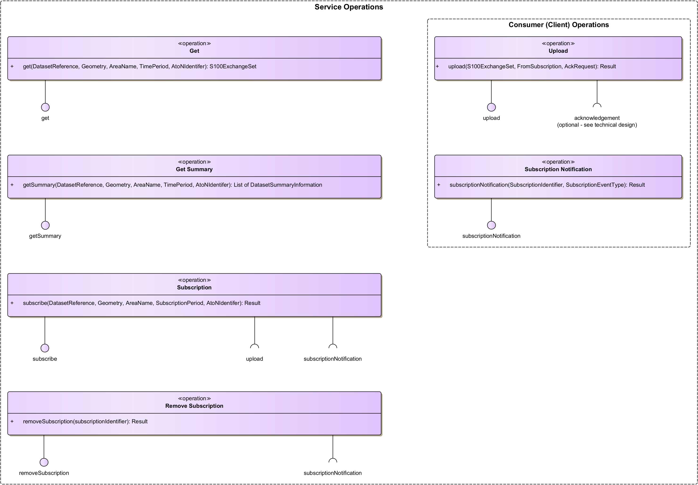
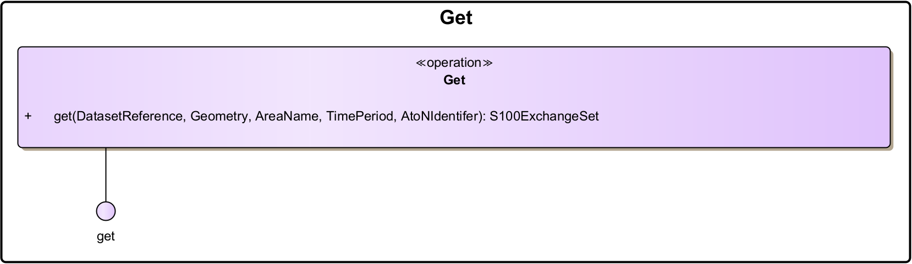
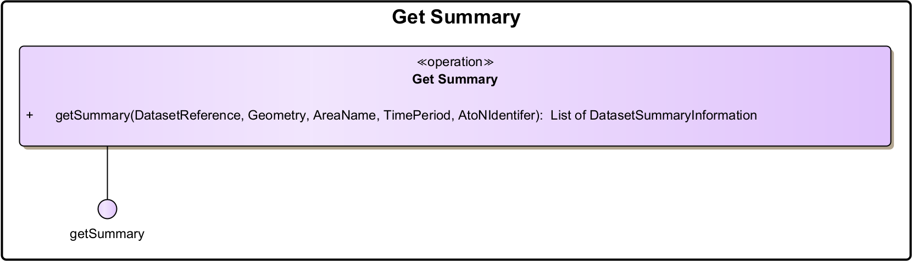
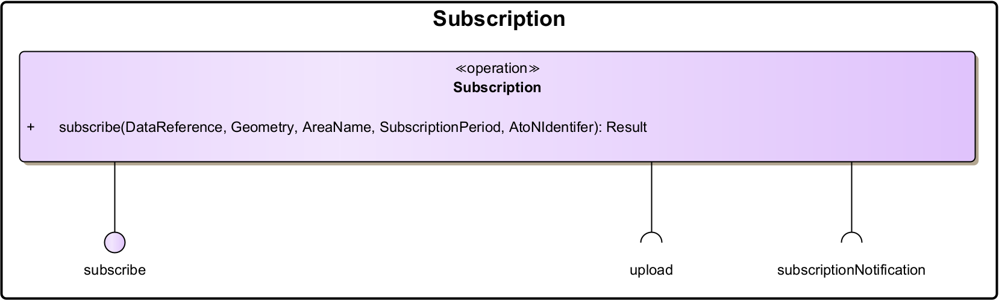
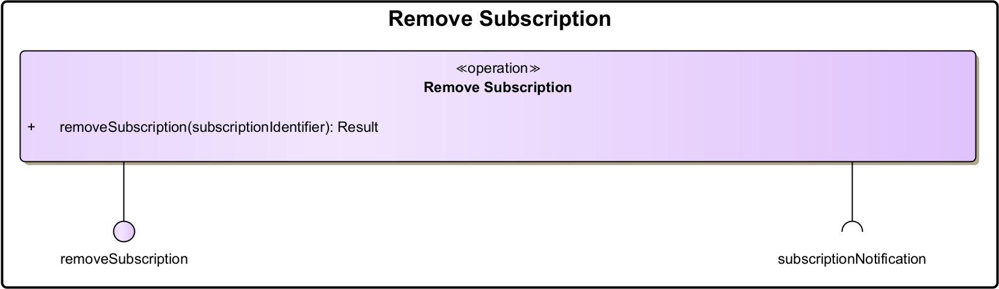
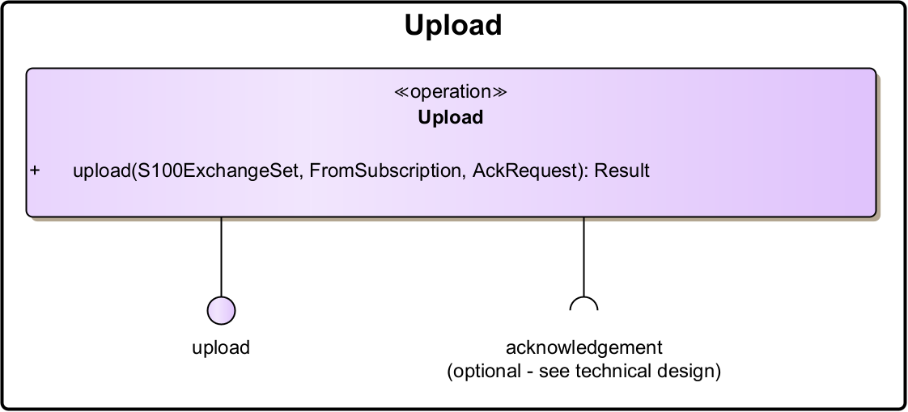
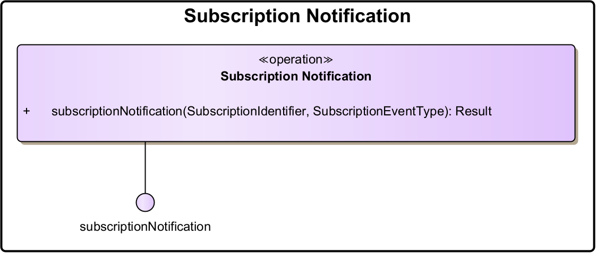

\pagebreak

# Service Overview {#sec:service_overview}

This section aims at providing an overview of the main elements of the service. Architectural elements applicable for this description are: 

* Service - the element representing the service, as a whole

* Service Operations - describe the logical operations used to access the service. Actual technical designs may rename some of the operations or ignore some of the operations if the operation is triggered in a different way e.g. API-based designs require more operations than an event-based design. Multiple service operations may also be implemented by a single API endpoint with e.g. different HTTP methods differentiating between operations.

* Service Operations Parameter Definitions - identify logical data structures being exchanged via Service Operations. These parameters must not be an exhaustive list but describe the parameters that are required for the business logic to work.

## The AtoN Information Service {#sec:the_aton_information_service}

In [@fig:s125_service_operations], below, an overview of the operations of the AtoN Information service is shown.

{#fig:s125_service_operations}

<table>
<thead>
<tr>
  <th></th>
  <th>Service Operation</th>
  <th>Exchange Pattern</th>
  <th>Definition</th>
</tr>
</thead>
<tbody>
<tr>
  <td rowspan="2">PULL</td>
  <td>Get</td>
  <td>REQUEST_RESPONSE</td>
  <td>Operation to (pull) ask for AtoN datasets from the producer.</td>
</tr>
<tr>
  <td>Get Summary</td>
  <td>REQUEST_RESPONSE</td>
  <td>Operation to (pull) ask for a list of summary information on the AtoN datasets made available by producer.</td>
</tr>
<tr>
  <td rowspan="2">SUBSCRIPTION</td>
  <td>Subscription</td>
  <td>REQUEST_CALLBACK</td>
  <td>Operation to create subscriptions on specific AtoN datasets.
    Relevant Client operations:
    <ul>
        <li>Subscription Notification</li>
        <li>Upload</li>
    </ul>
  </td>
</tr>
<tr>
  <td>Remove Subscription</td>
  <td>REQUEST_CALLBACK</td>
  <td>Operation to remove existing subscriptions.
    Relevant Client operations:
    <ul>
        <li>Subscription Notification</li>
    </ul>
  </td>
</tr>
</tbody>
</table>

<table>
<thead>
<tr>
  <th></th>
  <th>Client Operation</th>
  <th>Exchange Pattern</th>
  <th>Definition</th>
</tr>
</thead>
<tbody>
<tr>
  <td rowspan="1">PUSH</td>
  <td>Upload</td>
  <td>ONE_WAY or REQUEST_CALLBACK</td>
  <td>Operation for (pushing) uploading information to consumer. An acknowledgement whether the data have been successfully received and/or processed can optionally be requested.</td>
</tr>
<tr>
  <td rowspan="1">SUBSCRIPTION</td>
  <td>Subscription</td>
  <td>ONE_WAY</td>
  <td>Operation for notification from subscription events.
The implementation of a separate subscription notification operation on the AtoN Service clients is not necessarily required, depending on the choice of the underlying technology. When the subscription status information can be embedded onto the data upload operation, this operation may be omitted.</td>
</tr>
</tbody>
</table>

## Service Operations {#sec:service_operations}

This section describes the details of each service operation, along with the relevant parameter definitions. To establish a service for the exchange of AtoN information, information is mainly provided by the service provider and is requested from the service consumer via the interfaces of the service provider. However, requirement S-125R009 states that a consumer must also be able to subscribe to updates of the service information. On the technical level, this may be realized in different ways. For example, the SECOM standard [@cite:iec-63173-2] requires the consumer to expose interfaces, to which new information can be pushed directly. Other technical designs may use a message broker as a middleware between consumer and provider, such that the consumer must not expose any public interfaces. For this reason, the respective consumer operations are modelled separately at the end of this section and may be implemented by other technical means as the service provider’s operations.

To ensure the integrity of the transmitted information, responses or requests from the service provider must be signed digitally by the service provider independently from the signature that is applied to the S-125 dataset itself. The transmitted data may also be encrypted for transport. The authentication mechanism for service consumers is left as an implementation decision to the service provider.

Furthermore, operations that are used internally by an AtoN information service provider to transfer AtoN information datasets from an internal information management system to the specified service are not discussed, as they are specific to those systems and not relevant for consumers of the service.

This section covers only the static design description, while the dynamic design (behaviour) is described in [@sec:dynamic_behaviour]. The operations are designed to be compliant to the SECOM standard on a basic level. However, the SECOM standard explicitly prescribes the usage of certain technologies (such as REST). Therefore, this service specification provides an abstraction layer above SECOM that makes it possible to also realize the operations with different technology stacks.

### Get Operation {#sec:get_operation}

The *Get* operation is used by service consumers for filtering and retrieving AtoN information from a service provider, e.g. S-125 datasets that are applicable for a specified geographical area. The consumer can also filter the requested S-125 dataset results by a specific dataset reference identifier, a time period, an area name etc.

{#fig:get_operation width=75% }

#### Operation Functionality {#sec:get_operation_functionality}

This operation can be used for filtering and retrieving S-125 datasets from a service provider. It follows a request-response paradigm (REQUEST_RESPONSE), where a client queries the server, and based on a set of filtering criteria, receives an appropriate response back. The service response must be packaged as an S-100 Exchange Set, which contains all applicable S-125 datasets that match all the provided operation parameters, alongside any necessary metadata and support information. Other packaging formats are not supported by ECDIS and therefore are not included in this service specification. Each S-125 dataset contained in the response should include all AtoN entries allocated to it, **not** just the ones matching the operation parameters.

If multiple operation parameters are provided, only the results matching all requested filters are to be returned. If no operation parameters are provided, the response should include all datasets currently available in the service provider. A service provider may offer different encodings of AtoN information in accordance with the S-100 standard, which can be specified as an enumeration (XML/GML or binary). A service provider is required to offer at least one of the available encodings.

All instances of services providing AtoN information are required to support all operation parameters presented in the following sub-section [@sec:get_operation_parameters], apart from the `<TimePeriod>` which is optional. The specific encodings are left to be decided by the service technical design specification. In most cases the parameter description provides an adequate definition.

#### Operation Parameters {#sec:get_operation_parameters}

| Parameters (in) | Encoding | Mult. | Descriptions |
| --- | --- | ---  | --- |
| DatasetReference | See technical design | 0..1 | The dataset identifier of a specific S-125 dataset. A list of all supported references can be retrieved via Get Summary operation. If no references are provided, it's up to the service to decide what to return. |
| Geometry | See technical design | 0..1 | Geometry condition for geolocated information objects. This can be used to filter on geometric shapes (e.g. filter AtoN information S-125 datasets by a bounding box). |
| unlocode | See technical design | 0..1 | UN/LOCODE (United Nations Code for Trade and Transport Locations) of a defined object (e.g., “CN” for China). |
| TimePeriod (Optional) | See technical design | 0..1 | An optional parameter denoting the time period (ValidFrom, ValidTo) in which a dataset is valid and becomes subject to changes. The service response is expected to encompass all modifications that occurred within the specified interval and should be provided in the form of complete datasets or delta files, adhering to the specifications outlined in the S-100 data model specification. |

: The Get Operation Parameters. {#tbl:get_operational_parameters}

### Get Summary Operation {#sec:get_summary_operation}

The *Get Summary operation* is used by service consumers for retrieving a list of summary information (without the actual dataset contents), in order to discover which S-125 datasets are being currently made available (and are accessible) by a service provider. The service provider will respond by listing the available (and accessible) S-125 datasets that are of interest to the consumer. This list should only contain summary information on each dataset, not the dataset content itself. The dataset reference identifiers can be used to retrieve the full S-125 datasets via the Get operation. The consumer can filter the requested S-125 dataset summary results by a specific dataset identifier reference, a geometry, a time period, an area name etc.

{#fig:get_summary_operation}

#### Operation Functionality {#sec:get_summary_operation_functionality}

The operation can be used for filtering and retrieving the summary information regarding the S-125 datasets that are currently made available and accessible by the service provider. This operation is typically used to conserve bandwidth and make the query process faster, by initially retrieving only the summary information, and then only querying specific datasets from the service provider via the Get operation. It follows a request-response paradigm (REQUEST_RESPONSE), where a client queries the server, and based on a set of filtering criteria receives an appropriate response back. The server response should be formatted as a list of dataset summary objects. Each object contained in the list should **only** include summary information on the corresponding S-125 dataset, such as the data reference identifier, the status, a short description and the dataset size.

If multiple operation parameters are provided, only the results that match all requested filters should be included. If no parameters are given, the return should include all available datasets.

All instances of services providing AtoN information are required to support all operation parameters presented in the following sub-section [@sec:get_summary_operation_parameters], apart from the `<TimePeriod>` which is optional. The specific encodings are left to be decided by the respective service technical design specification. In most cases the parameter description provides an adequate definition.

#### Operation Parameters {#sec:get_summary_operation_parameters}

| Parameters (in) | Encoding | Mult. | Descriptions |
| --- | --- | ---  | --- |
| DatasetReference | See technical design | 0..1 | The dataset identifier of a specific S-125 dataset. If no references are provided, it's up to the service to decide what to return. |
| Geometry | See technical design | 0..1 | Geometry condition for geolocated information objects. This can be used to filter on geometric shapes (e.g. filter AtoN information by a bounding box). |
| unlocode | See technical design | 0..1 | UN/LOCODE (United Nations Code for Trade and Transport Locations) of a defined object (e.g., “CN” for China). |
| TimePeriod (Optional) | See technical design | 0..1 | An optional parameter denoting the time period (ValidFrom, ValidTo) in which a dataset is valid and becomes subject to changes. The service response should only include the S-125 datasets for which modifications occurred within the specified interval. |

: The Get Summary Operation Parameters. {#tbl:get_summary_operational_parameters}

| ReturnType (out) | Encoding | Mult. | Descriptions |
| --- | --- | ---  | --- |
| List of Dataset Summary Information | List of dataset summary information objects.  See technical design. | 0..* | Metadata of available AtoN information, that match the search parameters. |

: The Get Summary Operation Return Types. {#tbl:get_summary_return_types}

### Subscription Operation {#sec:subscription_operation}

The purpose of this operation is to facilitate subscriptions initiated by service consumers on specific AtoN information. The information a service consumer subscribes to, can either determined by the provided operation parameters, or decided upon by the service provider.

{#fig:subscription_operation width=75%}

#### Operation Functionality {#sec:subscription_operation_functionality}

The Subscription operation can be used by service consumers to subscribe to a specific set of S-125 datasets. The datasets that are covered by each subscription, are limited by the provided operation parameters, which include the dataset reference identifier. Note that the dataset reference identifiers of the S-125 datasets can be retrieved by the Get Summary operation. If no operational parameters are specified, the consumer is assumed to subscribe to updates on all available and valid datasets.

The operation follows a request-callback paradigm (REQUEST_CALLBACK), in which the consumers register their interest in a set of AtoN information and receive updates whenever one of the corresponding S-125 datasets change. The subscription can be cancelled through the Remove Subscription operation or can be limited by specifying a subscription period.

While on an active subscription, the service consumers will receive AtoN information packaged as an S-100 Exchange Set, which includes either the complete S-125 datasets for which updates exist, or just the incurred changes in the form of delta files, as these are defined in the S-100 data model specification [@cite:iho-s100]. In the latter case, it is recommended that before a consumer subscribes to updates, it initially requests all applicable S-125 datasets via the Get operation.

This operation consumes the following consumer operations:

* Upload
* Subscription Notification

The Upload consumer operation is utilised by the service provider to push the incurred S-125 dataset changes to the subscribed service consumer. The Subscription Notification operation on the other hand, is used to inform the consumer that on the status of the subscription, i.e. when it has been successfully activated or removed. More information on this operation can be found in the [@sec:dynamic_behaviour], describing the dynamic behaviour of the Subscription operation. Note that for each new subscription, a subscription identifier should be made available to the consumer.

All instances of services providing AtoN information are required to support all operation parameters presented in the following sub-section [@sec:subscription_operation_parameters], although the specific encodings are left to be decided by the service technical design specification. In most cases the parameter description provides an adequate definition.

#### Operation Parameters {#sec:subscription_operation_parameters}

| Parameters (in) | Encoding | Mult. | Descriptions |
| --- | --- | ---  | --- |
| DatasetReference | See technical design | 0..1 | The dataset identifier of a specific S-125 dataset. A list of all supported references can be retrieved via Get Summary operation. If no references are provided, it's up to the service to decide what to return. |
| Geometry | See technical design | 0..1 | Geometry condition for geolocated information objects. This can be used to filter on geometric shapes (e.g. filter AtoN information by a bounding box). |
| unlocode | See technical design | 0..1 | UN/LOCODE (United Nations Code for Trade and Transport Locations) of a defined object (e.g., “CN” for China). |
| SubscriptionPeriod | See technical design | 0..1 | The period for which the subscription is active (start and end date/time). |

: The Subscription Operation Parameters. {#tbl:subscription_operational_parameters}

| ReturnType (out) | Encoding | Mult. | Descriptions |
| --- | --- | ---  | --- |
| Result | List of dataset summary information objects.  See technical design. | 0..1 | Confirmation or error message. On confirmation, it must include a Subscription Identifier for the created subscription, which can then be used to remove the subscription. If the subscription corresponds to more than one information object, all information objects will be part of one subscription. |

: The Subscription Operation Return Types. {#tbl:subscription_return_types}

### Remove Subscription Operation {#sec:remove_subscription_operation}

Subscriptions are removed either internally by the service provider, or externally by the service consumer. This operation can be used by the consumer to request the removal of an active subscription.

{#fig:remove_subscription_operation width=75%}

#### Operation Functionality {#sec:remove_subscription_operation_functionality}

The Remove Subscription operation should be used to remove subscriptions that were created earlier through the Subscription operation. The operation follows a request-callback paradigm (REQUEST_CALLBACK), where a client expects a subscription notification to be sent back asynchronously, in order to confirm the successful removal of the requested subscriptions. In this operation, the consumer can optionally provide the subscription identifier, acquired through the Subscription operation response, to select the individual subscription to be removed. Alternatively, if no subscription identifier is provided, all active subscriptions for this consumer will be removed.

This operation consumes the following operations:

* Subscription Notification

The Subscription Notification operation is used to inform the consumer that on the status of the subscription, i.e. when it has been successfully removed.

#### Operation Parameters {#sec:remove_subscription_operation_parameters}

| Parameters (in) | Encoding | Mult. | Descriptions |
| --- | --- | ---  | --- |
| SubscriptionIdentifier | See technical design | 0..1 | A specific identifier of the information object to remove the subscription for. If no subscription identifier is provided, all subscriptions for the consumer are removed. |

: The Remove Subscription Operation Parameters. {#tbl:remove_subscription_operational_parameters}

| ReturnType (out) | Encoding | Mult. | Descriptions |
| --- | --- | ---  | --- |
| Result | List of dataset summary information objects.  See technical design. | 0..1 | Confirmation or error message. |

: The Remove Subscription Operation Return Types. {#tbl:remove_subscription_return_types}

### Upload Operation {#sec:upload_operation}

The purpose of this operation is to allow service providers to upload (push) AtoN information to a service consumer. Hence, a consumer needs to implement this functionality as a separate operation or support it through the technology selected for the subscription operation, in order to receive S-125 datasets from a subscription or a unicast/broadcast operation.

**Note**: This may not be implemented as a separate interface as different technologies already implement this functionality on other levels (e.g., by using a message-oriented middleware like the MCP MMS, RabbitMQ or Kafka). 

{#fig:upload_operation width=75%}

#### Operation Functionality {#sec:upload_operation_functionality}

This operation allows service consumers to be directly informed about new or updated S-125 datasets made available. The operation may follow two types of exchange patterns. The first one is a one-way paradigm (ONE_WAY), where a service sends data to the consumer without expecting information back, other than a technical response. Alternatively, a request-callback paradigm (REQUEST_CALLBACK) can be employed, where uploads are expected to result in an acknowledgement message sent asynchronously back. This acknowledgement should be directed to an Acknowledgement operation of the service provider. This mechanism however, as well as the operation specification, is left to be defined at the service design level, as it is considered to be implementation specific.

This operation can be used both in single uploads and uploads under a subscription. The parameter `<FromSubscription>` indicates whether the upload took place within or outside a subscription by the consumer. 

As stated previously, this operation may optionally consume the following operations:

* Acknowledgement

When uploading an AtoN information message and if this functionality is actually supported by the service provider, the acknowledgement can be requested through the `<AckRequest>` operational parameter. The encoding of this parameter is left to be defined by the technical service specification, as it is implementation specific. For example, in SECOM this would be represented by a simple Boolean value, while other technologies may require to a more complex structure that defines the location of the provider service endpoint, as well as authentication information.

The acknowledgement message may be expected to be received when the uploaded message has been delivered to end system (technical acknowledgement), and/or if supported, when the message has been opened (read) by the end user (operational acknowledgement). More information on this operation can be found in Section 6.2, describing the dynamic behavior description of the subscription on AtoN information.

#### Operation Parameters {#sec:upload_operation_parameters}

| Parameters (in) | Encoding | Mult. | Descriptions |
| --- | --- | ---  | --- |
| S100ExchangeSet | S100ExchangeSet | 1 | S-125 datasets which conform to the data product specification including the service metadata (see Section 5). |
| FromSubscription (Optional) | See technical design | 0..1 | Flag to indicate whether the payload has been uploaded within an active subscription or not. |
| AckRequest (Optional) | See technical design | 0..1 | Flag to indicate that acknowledgement is expected when delivered, and an acknowledgement when message has been opened (read) by end user. |

: The Upload Operation Parameters. {#tbl:upload_operational_parameters}

| ReturnType (out) | Encoding | Mult. | Descriptions |
| --- | --- | ---  | --- |
| Result | See technical design | 1 | Confirmation or error message. |

: The Upload Operation Return Types. {#tbl:upload_return_types}

### Subscription Notification Operation (Consumer Operation - Optional) {#sec:subscription_notification_operation}

This operation is used by service consumers to receive notifications by a service provider, when a subscription is created or removed.

**Note**: This may not be implemented as a separate operation as different technologies already implement this functionality on other levels (e.g., by using a message-oriented middleware like the MCP MMS, RabbitMQ or Kafka). 

{#fig:subscription_notification_operation width=75%}

#### Operation Functionality {#sec:subscription_notification_operation_functionality}

The operation receives notifications by the service provider, when a subscription is created or removed, either internally by information owner, or externally on request. This operation follows a one-way paradigm (ONE_WAY), where a service sends data to consumer without expecting information back, other than a technical response. More information on this operation can be found in Section [@sec:dynamic_behaviour], describing the dynamic behavior description of the subscription on AtoN information.

#### Operation Parameters {#sec:subscription_notification_operation_parameters}

| Parameters (in) | Encoding | Mult. | Descriptions |
| --- | --- | ---  | --- |
| SubscriptionIdentifier (Optional) | See technical design | 1 | Specific identifier of the subscription for which the status has being updated. |
| SubscriptionEvent | See technical design | 1 | Type of subscription status update event; Created or Deleted/Removed. |

: The Subscription Notification Operation Parameters. {#tbl:subscription_notification_operational_parameters}

| ReturnType (out) | Encoding | Mult. | Descriptions |
| --- | --- | --- | --- |
| Result | See technical design | 1 | Confirmation or error message. |

: The Subscription Notification Operation Return Types. {#tbl:subscription_notification_return_types}